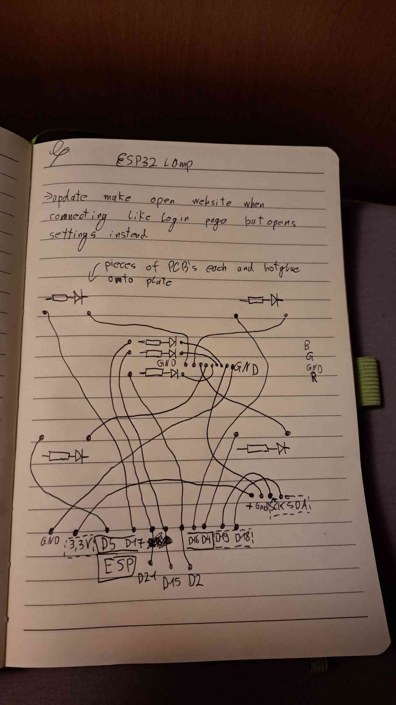
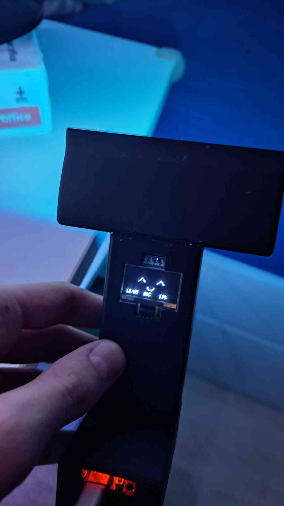
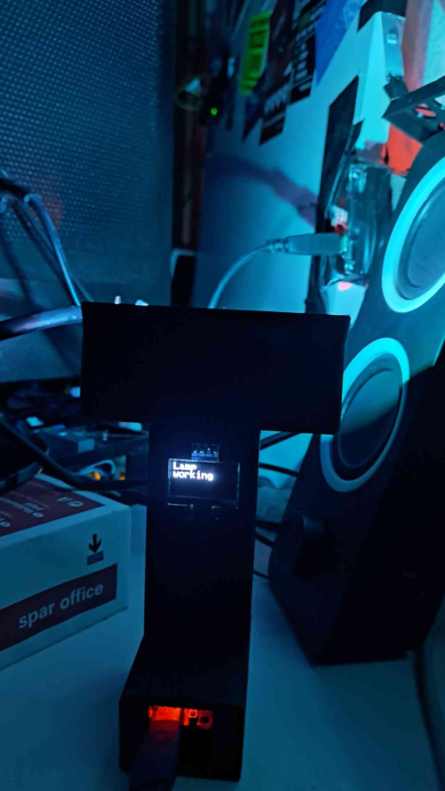
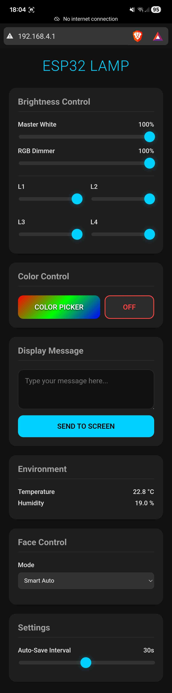

# ESP32 Smart Lamp with Faces

## Contents

* [Features](#features)
* [Hardware Setup](#hardware-setup)

  * [Components](#components)
  * [Wiring Diagram](#wiring-diagram)
* [Installation](#installation)
* [Usage](#usage)
* [Customization](#customization)
* [Gallery](#gallery)

A feature-rich, interactive smart lamp powered by an ESP32. This project combines PWM LED control (White & RGB), an OLED display for animated "Dasai Mochi" style faces, and environmental monitoring using a DHT11 sensor.

## Features

* **Web Interface**: Host a local Wi-Fi Access Point (`ESP Lamp`) to control everything from your phone or PC.
* **LED Control**:

  * 4x Independent White LED Channels (PWM).
  * 1x RGB LED Channel (PWM) with Color Picker.
  * Master Brightness and RGB Dimmer.
* **OLED Display**:

  * **Faces**: Animated, expressive faces that change every 7 seconds.
  * **Smart Reactions**: Faces react to time of day (Sleepy, Night Owl) and temperature (Sweating if hot, Shivering if cold).
  * **Info Dashboard**: Displays current Time, Temperature, and Humidity at the bottom.
  * **Custom Text**: Send custom messages to the screen via the web UI.
* **Face Modes**:

  * **Smart Auto**: Reacts to environment and time.
  * **Random Shuffle**: Cycles through selected categories (Happy, Goofy, Sleepy).
  * **Manual**: Force a specific face expression.
* **Persistent Settings**: Remembers your LED levels, color, and configuration after reboot.

## Hardware Setup

### Components

* ESP32 Development Board
* 0.96" SSD1306 OLED Display (I2C)
* DHT11 Temperature & Humidity Sensor
* 4x White LEDs (or LED Strips with MOSFETs)
* 1x RGB LED (Common Cathode or Anode, configured for PWM)
* Resistors and Power Supply appropriate for your LEDs

### Wiring Diagram

**Pinout Configuration:**

| Component       | ESP32 Pin               | Notes                                  |
| :-------------- | :---------------------- | :------------------------------------- |
| **White LED 1** | GPIO 5                  | PWM Channel 0                          |
| **White LED 2** | GPIO 17                 | PWM Channel 1                          |
| **White LED 3** | GPIO 16                 | PWM Channel 2                          |
| **White LED 4** | GPIO 4                  | PWM Channel 3                          |
| **Red LED**     | GPIO 2                  | PWM Channel 4                          |
| **Green LED**   | GPIO 15                 | PWM Channel 5                          |
| **Blue LED**    | GPIO 21                 | PWM Channel 6                          |
| **OLED SDA**    | GPIO 21 (Default) or 18 | *Check code: `Wire.begin(18,19)` used* |
| **OLED SCL**    | GPIO 22 (Default) or 19 | *Check code: `Wire.begin(18,19)` used* |
| **DHT11 Data**  | GPIO 23                 | **Added Update**                       |

> **Note on DHT11**: The DHT11 sensor was added in a later revision to enable environmental reactivity. It is connected to **GPIO 23**. Ensure you have a pull-up resistor (4.7k-10k) between VCC and Data if your module doesn't have one built-in.

## Installation

1. **Install PlatformIO**: This project is built using PlatformIO for VS Code.
2. **Open Project**: Open the `testlamp` folder in VS Code.
3. **Dependencies**: PlatformIO will automatically install the required libraries:

   * `Adafruit SSD1306`
   * `Adafruit GFX Library`
   * `DHT sensor library for ESPx`
4. **Upload**: Connect your ESP32 and click the "Upload" arrow in the bottom status bar.
5. **Upload Filesystem** (Optional): If using SPIFFS for static files (currently code uses embedded HTML).

## Usage

1. **Power On**: The OLED will show "Starting WiFi...".
2. **Connect**: Connect your phone/PC to the Wi-Fi network:

   * **SSID**: `ESP Lamp`
   * **Password**: `password123`
3. **Control**: Open a web browser and go to `http://192.168.4.1`.
4. **Face Control**:

   * Go to the "Face Control" card to switch between Auto, Shuffle, and Manual modes.
   * Toggle categories like "Happy", "Goofy", or "Sleepy" to customize the shuffle.

## Customization

* **Faces**: You can add more faces by editing the `drawEye` and `drawMouth` functions in `src/main.cpp`.
* **Logic**: The "Smart Auto" logic is located in the main loop. You can adjust the temperature thresholds or time ranges for specific moods.

## Gallery

  

